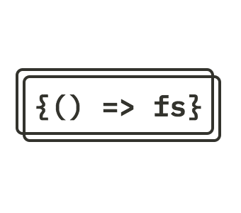

# Fullstack-Open

This repository is exclusively made for the exercises of Fullstack-open course by ***University of Helsinki***

 

## :diamond_shape_with_a_dot_inside: **Course's goal:**

This course serves as an introduction to modern web application development with JavaScript. 
The main focus is on building single page applications with ReactJS that use REST APIs built with Node.js. 
The course also contains a section on GraphQL, a modern alternative to REST APIs.

## :page_with_curl: **Technologies used:** 

 
  &nbsp;
  &nbsp;
  &nbsp;
  &nbsp;
  &nbsp;
  &nbsp;

- React
- Nodejs
- Redux
- Mongodb
- GraphQl
- Typescript

 
  
